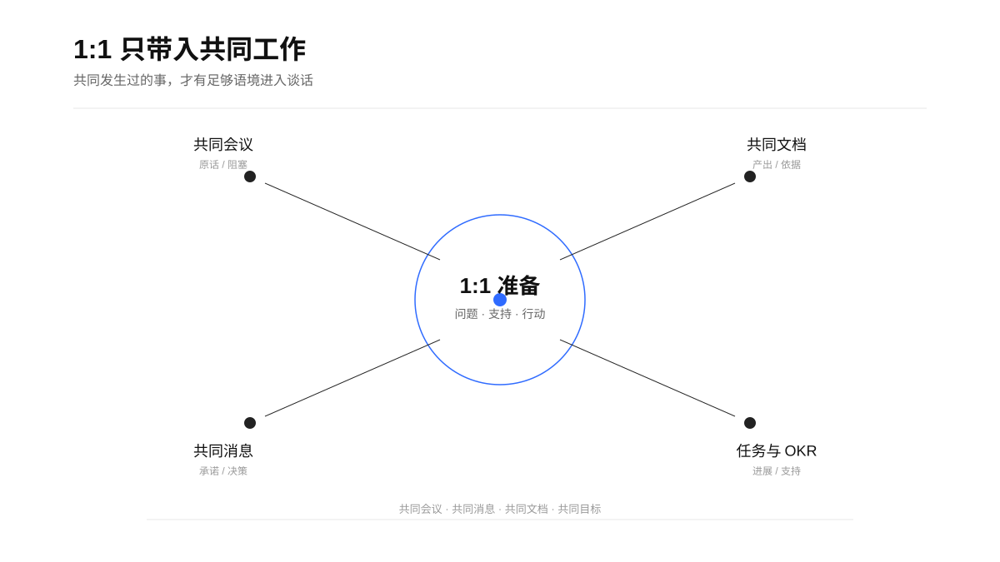
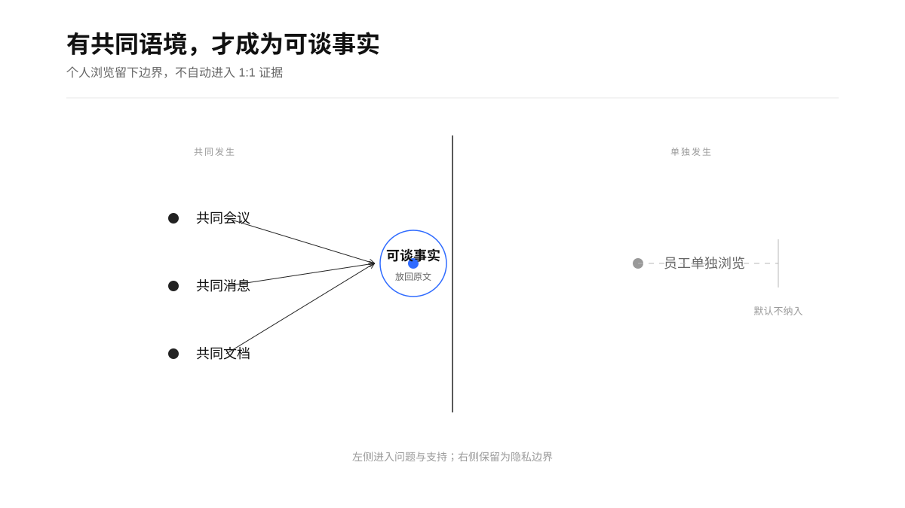
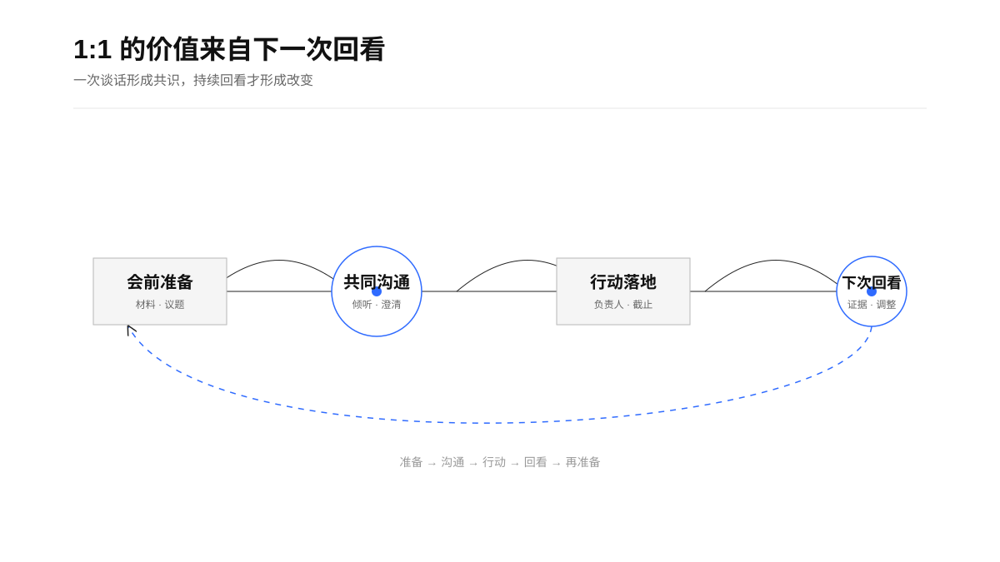
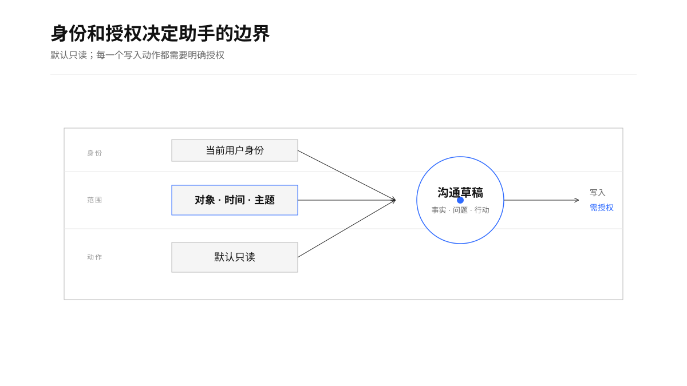

> “The output of a manager is the output of the organizational units under his or her supervision or influence.” — Andy Grove, *High Output Management* ([source](https://openlibrary.org/books/OL3161621M/High_Output_Management))

<p align="center">
  
  
  =3.8">
  
</p>

# 1:1 沟通助手

一个面向管理者的飞书 Agent Skill：把即将发生的一次 1:1 放回双方最近的共同工作里，帮助管理者准备议程、提炼可核验事实、整理会后共识，并跟进下一步行动。

它解决的核心问题很具体：管理者知道要和员工沟通，却缺少足够的共同上下文；会议结束后有共识，却没有形成可回看的行动闭环。

## 给执行 Agent 的契约

`SKILL.md` 是执行入口，`agents/openai.yaml` 是运行器的 UI 元数据，`references/runtime.md` 是运行时契约。Agent 每次触发都先确认对象、时间、模式和输出用途，再校验当前飞书用户身份与租户。

| 项目 | 默认规则 |
| --- | --- |
| 触发 | 1:1、一对一、会前准备、会后纪要、行动回看 |
| 读取 | 当前用户有权访问的最小相关范围，默认近 30 天共同协作 |
| 输出 | 数据范围、证据时间线、事实/表达/观察/推断/未知、1—3 项行动 |
| 写入 | 默认关闭；写文档、建任务、改妙记、发消息需明确授权并回读 |
| 降级 | 能力或权限不足时标记“未覆盖”，不使用 bot 或推测补齐 |
| 目标 | 改善沟通和行动闭环，不做人事裁决或员工画像 |

运行时检查：

```bash
scripts/doctor.sh --json
python3 scripts/smoke_test.py
```

## 它怎么工作

Skill 默认读取当前用户有权访问、且与本次沟通直接相关的最小范围信息。近 30 天的共同会议、共同消息线程、共同编辑或明确共享的工作文档、相关任务和 OKR 进展，组成会前的协作上下文。

<p align="center">
  
</p>

它把材料整理成证据时间线，再区分事实、员工已表达、管理者观察、待验证推断和未知。原始会议表达与可定位的共同文档产出优先级更高，平台自动总结只作为索引。

<p align="center">
  
</p>

## 三种使用方式

### 会前准备

```text
使用 $one-on-one-manager，帮我准备明天下午和李四的 1:1。
重点看近 30 天共同协作中的项目阻塞、上次行动项和员工可能想讨论的事项。
```

输出一份 30 分钟左右的轻量材料，包括：

- 本次沟通目标
- 上次行动回看
- 共同协作上下文与证据时间线
- 对方议题和待确认事项
- 3—5 个开放式问题
- 管理者可以提供的支持
- 1—3 项行动和下一次回看点

默认让员工先带入议题，管理者发言控制在约一成以内，避免把 1:1 变成项目状态会。

### 会后整理

```text
请基于这次 1:1 的逐字稿，整理双方共识、分歧、行动项和下一次回看点。
把适合共享的内容和仅供管理者确认的草稿分开。
```

### 行动跟进

```text
回看我和李四上次 1:1 的行动项，找出已完成、进行中和被阻塞的事项，
并给出下一次沟通最值得追问的三个问题。
```

<p align="center">
  
</p>

## 飞书能力路由

| 任务 | 飞书能力 | 默认范围 |
| --- | --- | --- |
| 找 1:1 日程 | Calendar | 指定日期、对象或关键词 |
| 读取共享 1:1 文档 | Docs / Drive | 已知链接或用户明确授权的文档 |
| 找共同会议与妙记 | VC / Note / Minutes | 双方共同参加、相关时间和工作主题 |
| 搜索共同消息 | IM | 双方共同参与的 P2P 或群组线程 |
| 读取任务与 OKR | Task / OKR | 与本次沟通直接相关的事项 |
| 写入文档、建任务、发消息 | 对应写入能力 | 用户明确授权后执行并回读 |

## 权限与隐私边界

身份、数据范围和副作用是这类 Skill 的核心设计。默认使用当前用户身份读取，默认只读；写入共享文档、创建任务、修改妙记或发送消息，都需要明确授权和结果验证。

<p align="center">
  
</p>

- 共同工作材料进入默认上下文；员工单独浏览过哪些文档不作为默认输入。
- 浏览行为本身不构成工作表现证据，也不用于生成员工画像。
- 不生成绩效等级、晋升推荐、调薪建议、淘汰建议或离职预警。
- 涉及健康、家庭、薪酬、投诉、纪律、医疗等敏感内容时，采用最小留存并提示人工升级路径。
- 输出会标明数据时间范围、实际读取的数据源和未覆盖范围；权限不足时保留未知，不用推测补齐。

## 安装

将本目录放入 Codex 的 Skill 目录：

```bash
cp -R one-on-one-manager "$CODEX_HOME/skills/one-on-one-manager"
```

如果本地没有设置 `CODEX_HOME`，也可以放到 `~/.codex/skills/one-on-one-manager`。

使用前确认飞书用户身份和租户：

```bash
lark-cli auth status --json --verify
```

支持 `auth status --json --verify` 的环境必须校验到 `identity=user`、`verified=true`。当前 CLI 构建若没有 `auth` 子命令，可退回 `contact +get-user --as user` 或 `task +get-my-tasks --as user` 做只读兼容探测；实际写文档、建任务或发消息前，仍要确认目标用户和租户。

真实读取个人日程、私有文档、历史会议或聊天时，使用用户身份；企业飞书与个人飞书保持隔离。

## 文件结构

```text
one-on-one-manager/
├── SKILL.md
├── agents/openai.yaml
├── references/
│   ├── feishu-routing.md
│   ├── one-on-one-principles.md
│   ├── runtime.md
│   └── output-templates.md
├── scripts/
│   ├── doctor.sh
│   └── smoke_test.py
└── assets/boards/
    ├── collaboration-context.svg
    ├── evidence-gate.svg
    ├── one-on-one-loop.svg
    └── permissions-boundary.svg
```

## 当前状态

这是一个可直接放入 Codex 的 Skill。它依赖本地可用的飞书 CLI 和对应领域能力；实际能读取哪些会议、消息、文档和任务，取决于当前用户权限、租户和飞书资源本身。

本仓库只包含通用 Skill 逻辑、公开说明和可迁移的沟通原则，不包含任何员工数据、聊天记录、会议内容、内部链接或认证信息。
